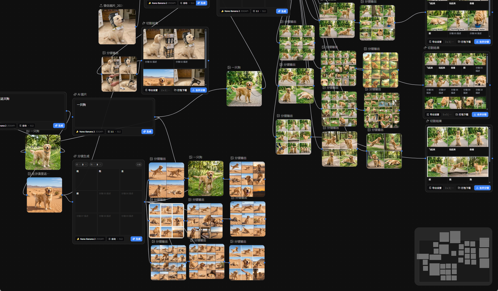
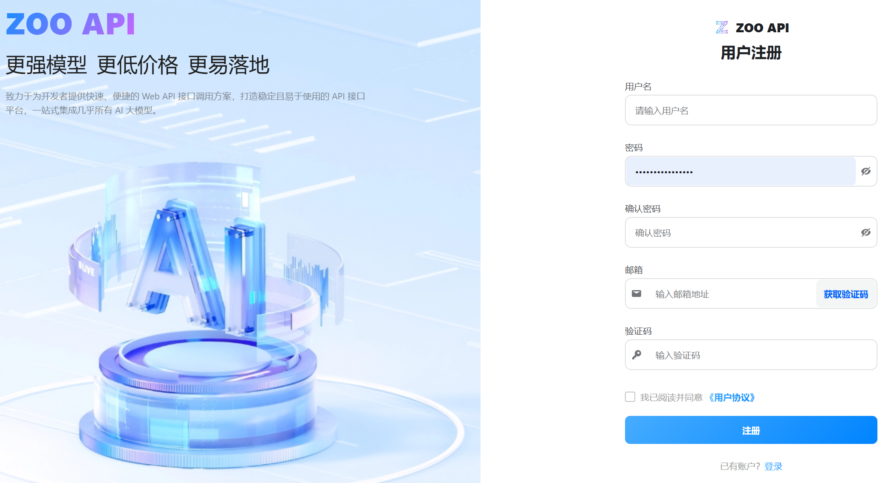
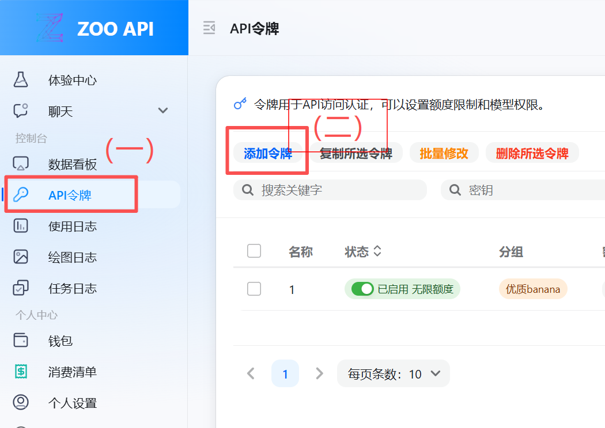
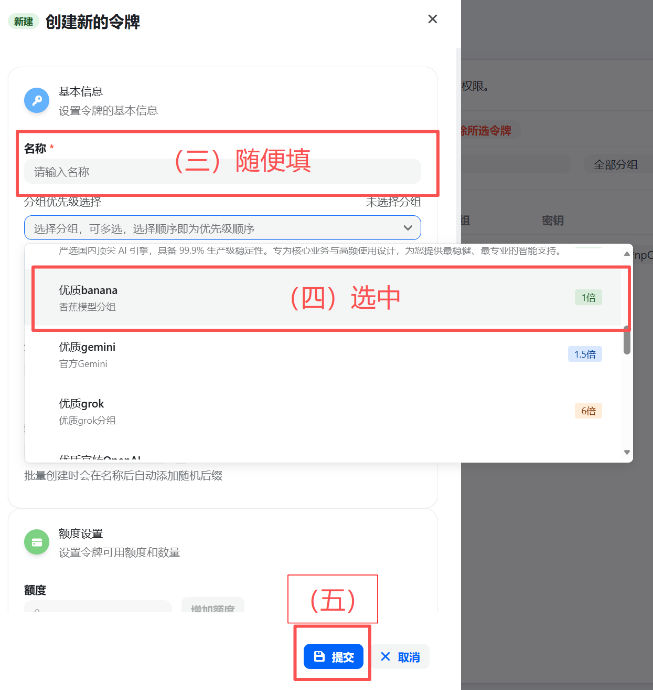
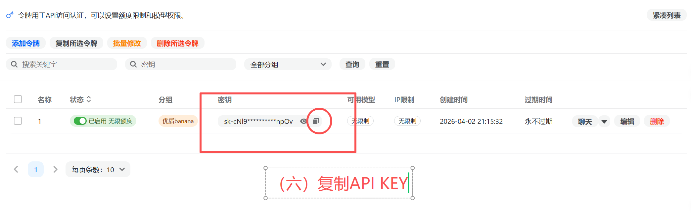

  
  <h1>分镜画布</h1>
  
基于节点画布的AI分镜工作台，一站式完成图片生成编辑与分镜流程。

## 项目说明

本项目是基于开源项目 [Storyboard-Copilot](https://github.com/henjicc/Storyboard-Copilot) 的优化与改进版本。

感谢原作者和开源贡献者提供的项目基础，让我们可以在此之上继续完善分镜生成、编辑与工作流体验。

## 示例图

## 下载

- GitHub Releases 下载：<https://github.com/zhaohc1010/FrameForge-Studio/releases>
- 夸克网盘下载：<https://pan.quark.cn/s/686415d3cd70>

说明：
- Windows 用户优先下载 `.exe` 安装包
- 如果 `.exe` 安装不方便，也可以下载 `.msi`

## API Key 获取方法

### 第一步，注册 Zoo API 网站

### 第二步，在左侧找到 API 令牌，点击添加令牌

### 第三步，随便填入一个名称，分组选择优质 banana，接着点击提交

### 第四步，复制 API Key 密钥并粘贴进软件设置

